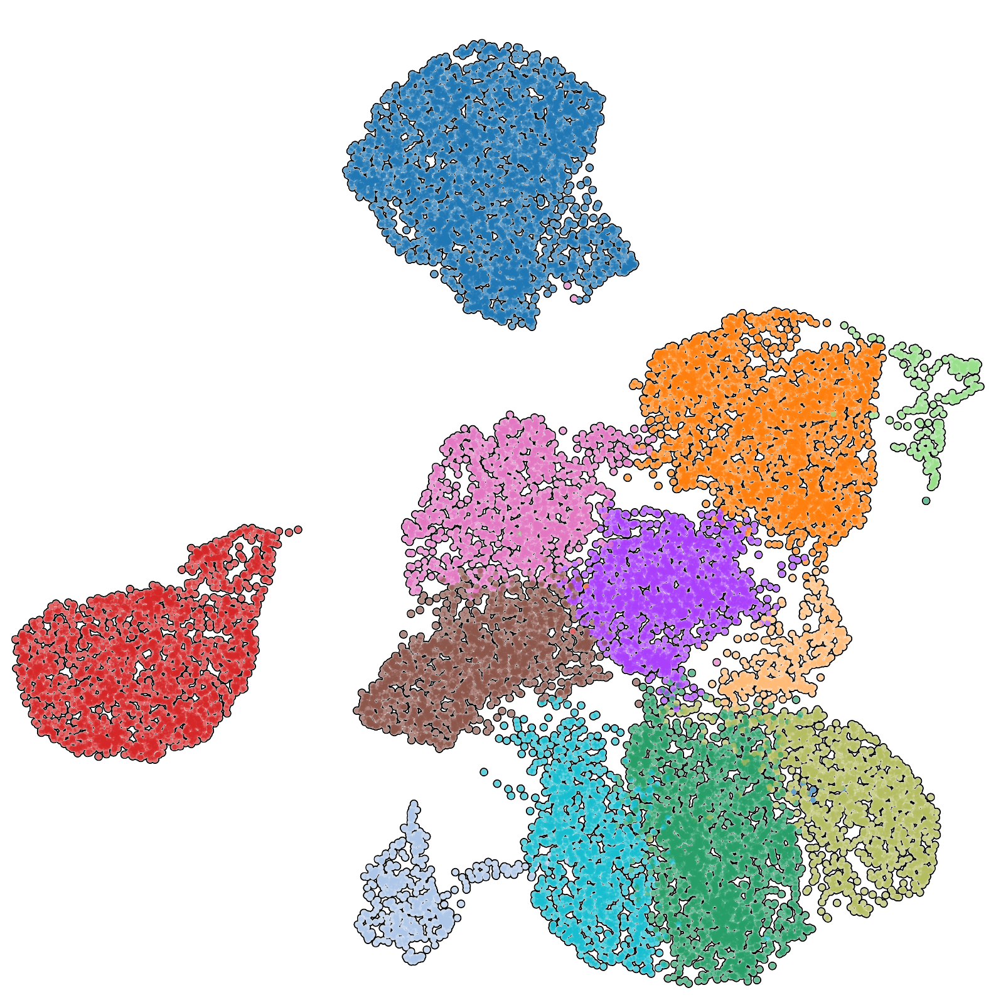

# polCAs

**Polarized cortical assembloids (polCAs)**

Here the code used to analyse polCAs Single Cell data

Data should be placed as follows:    
Anndata of Badhuri et. al (10.1038/s41586-021-03910-8)    ./data/Badhuri_atlas.h5ad    
Ppoliudakis et. al(10.1016/j.neuron.2019.06.011):    ./data/Geschwind_atlas.h5ad    
Raw data of experiments (control1_piece1, control1_piece2 ... polaroid3_distal):    ./data    
or pre-processed polCAs (optional):    ./outdir/02C_Preprocess_final.h5ad

An html version of the notebooks is accessible [here](https://GiuseppeTestaLab.github.io/polCAs/).

## Badhuri0.Preprocess

Links: [jupyter notebook](Badhuri0.Preprocess.ipynb) and [html file](https://GiuseppeTestaLab.github.io/polCAs/Badhuri0.Preprocess.html).

## Badhuri01B.ProgenitorsReanalysis

Links: [jupyter notebook](Badhuri01B.ProgenitorsReanalysis.ipynb) and [html file](https://GiuseppeTestaLab.github.io/polCAs/Badhuri01B.ProgenitorsReanalysis.html).

## Badhuri01C.CyclingReanalysis

Links: [jupyter notebook](Badhuri01C.CyclingReanalysis.ipynb) and [html file](https://GiuseppeTestaLab.github.io/polCAs/Badhuri01C.CyclingReanalysis.html).

## Badhuri02.preBulk

Links: [jupyter notebook](Badhuri02.preBulk.ipynb) and [html file](https://GiuseppeTestaLab.github.io/polCAs/Badhuri02.preBulk.html).

## Badhuri02B.pseudoBulking

Links: [jupyter notebook](Badhuri02B.pseudoBulking.ipynb) and [html file](https://GiuseppeTestaLab.github.io/polCAs/Badhuri02B.pseudoBulking.html).

## Badhuri03A_Neurons.3pointsModel

Links: [jupyter notebook](Badhuri03A_Neurons.3pointsModel.pBulk_byArea_scaling.ipynb) and [html file](https://GiuseppeTestaLab.github.io/polCAs/Badhuri03A_Neurons.3pointsModel.pBulk_byArea_scaling.html).

## Badhuri03B_Progenitors.3pointsModel

Links: [jupyter notebook](Badhuri03B_Progenitors.3pointsModel.pBulk_byArea_scaling.ipynb) and [html file](https://GiuseppeTestaLab.github.io/polCAs/Badhuri03B_Progenitors.3pointsModel.pBulk_byArea_scaling.html).

## Badhuri03C_Cycling.3pointsModel

Links: [jupyter notebook](Badhuri03C_Cycling.3pointsModel.pBulk_byArea_scaling.ipynb) and [html file](https://GiuseppeTestaLab.github.io/polCAs/Badhuri03C_Cycling.3pointsModel.pBulk_byArea_scaling.html).

## polCAs01_RawImport

Links: [jupyter notebook](polCAs01_RawImport.ipynb) and [html file](https://GiuseppeTestaLab.github.io/polCAs/polCAs01_RawImport.html).

## polCAs02_Preprocess_Gruffi

Links: [jupyter notebook](polCAs02_Preprocess_Gruffi.ipynb) and [html file](https://GiuseppeTestaLab.github.io/polCAs/polCAs02_Preprocess_Gruffi.html).

## polCAs03_Dimreduct_exploration

Links: [jupyter notebook](polCAs03_Dimreduct_exploration.ipynb) and [html file](https://GiuseppeTestaLab.github.io/polCAs/polCAs03_Dimreduct_exploration.html).

## polCAs04_Dimreduct_inDepthMarkers

Links: [jupyter notebook](polCAs04_Dimreduct_inDepthMarkers.ipynb) and [html file](https://GiuseppeTestaLab.github.io/polCAs/polCAs04_Dimreduct_inDepthMarkers.html).

## polCAs04.2_Differential_abundance

Links: [jupyter notebook](polCAs04.2_Differential_abundance.ipynb) and [html file](https://GiuseppeTestaLab.github.io/polCAs/polCAs04.2_Differential_abundance.html).

## polCAs05_RG_and_Neurons_Focus

Links: [jupyter notebook](polCAs05_RG_and_Neurons_Focus.ipynb) and [html file](https://GiuseppeTestaLab.github.io/polCAs/polCAs05_RG_and_Neurons_Focus.html).

## polCAs06_Dimreduct_inDepthCompositions

Links: [jupyter notebook](polCAs06_Dimreduct_inDepthCompositions.ipynb) and [html file](https://GiuseppeTestaLab.github.io/polCAs/polCAs06_Dimreduct_inDepthCompositions.html).

## polCAs07B_Correlation_celltypes_areas

Links: [jupyter notebook](polCAs07B_Correlation_celltypes_areas.ipynb) and [html file](https://GiuseppeTestaLab.github.io/polCAs/polCAs07B_Correlation_celltypes_areas.html).

## polCAs07_Correlation_celltypes

Links: [jupyter notebook](polCAs07_Correlation_celltypes.ipynb) and [html file](https://GiuseppeTestaLab.github.io/polCAs/polCAs07_Correlation_celltypes.html).

## polCAs08_Developmental_Trajectories

Links: [jupyter notebook](polCAs08_Developmental_Trajectories.ipynb) and [html file](https://GiuseppeTestaLab.github.io/polCAs/polCAs08_Developmental_Trajectories.html).

## polCAsCycling01_Selection

Links: [jupyter notebook](polCAsCycling01_Selection.ipynb) and [html file](https://GiuseppeTestaLab.github.io/polCAs/polCAsCycling01_Selection.html).

## polCAsCycling02_pBulk

Links: [jupyter notebook](polCAsCycling02_pBulk.ipynb) and [html file](https://GiuseppeTestaLab.github.io/polCAs/polCAsCycling02_pBulk.html).

## polCAsCycling03_fg8_tomato_check

Links: [jupyter notebook](polCAsCycling03_fg8_tomato_check.ipynb) and [html file](https://GiuseppeTestaLab.github.io/polCAs/polCAsCycling03_fg8_tomato_check.html).

## polCAsCycling04_pBulk_bySegment.DEA

Links: [jupyter notebook](polCAsCycling04_pBulk_bySegment.DEA.ipynb) and [html file](https://GiuseppeTestaLab.github.io/polCAs/polCAsCycling04_pBulk_bySegment.DEA.html).

## polCAsCycling05A_POLAROIDS_BadhuriSpace

Links: [jupyter notebook](polCAsCycling05A_POLAROIDS_BadhuriSpace.ipynb) and [html file](https://GiuseppeTestaLab.github.io/polCAs/polCAsCycling05A_POLAROIDS_BadhuriSpace.html).

## polCAsCycling05B_CONTROLS_BadhuriSpace

Links: [jupyter notebook](polCAsCycling05B_CONTROLS_BadhuriSpace.ipynb) and [html file](https://GiuseppeTestaLab.github.io/polCAs/polCAsCycling05B_CONTROLS_BadhuriSpace.html).

## polCAsCycling05C_ALL_BadhuriSpace

Links: [jupyter notebook](polCAsCycling05C_ALL_BadhuriSpace.ipynb) and [html file](https://GiuseppeTestaLab.github.io/polCAs/polCAsCycling05C_ALL_BadhuriSpace.html).

Repository will be complete upon publication

---
*Note: this README file has been generated automatically.*  
*Please do not modify it directly but instead work on [this config file](resources/config.yaml).*

